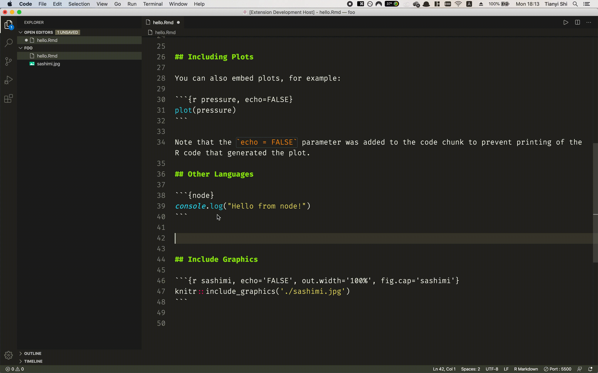
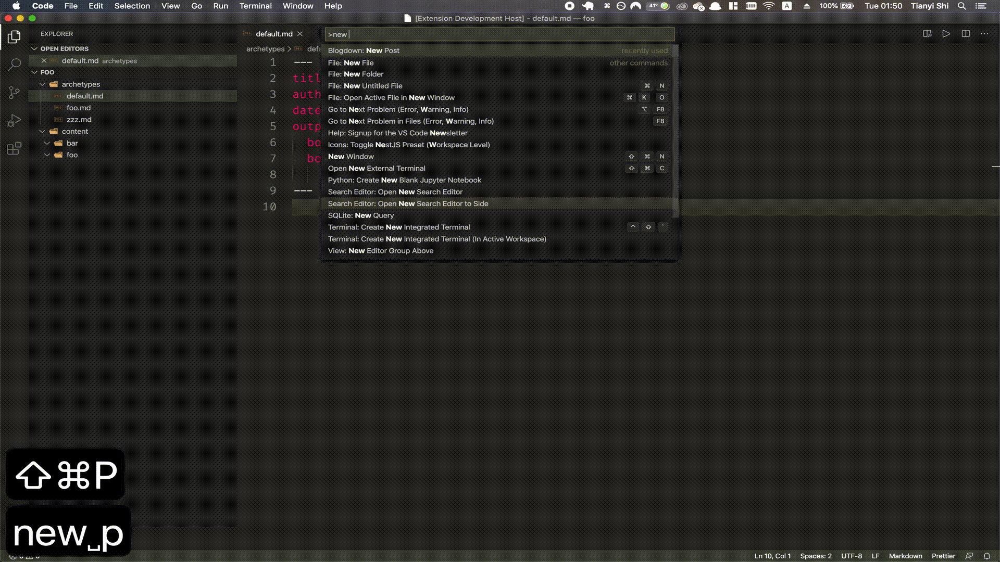
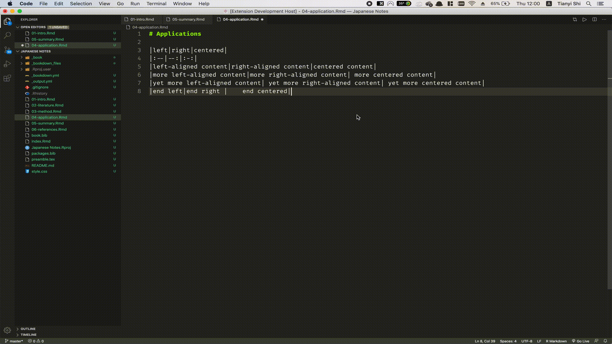

# R Markdown All-in-One for VS Code

[](https://marketplace.visualstudio.com/items?itemName=TianyiShi.rmarkdown)
[](https://marketplace.visualstudio.com/items?itemName=TianyiShi.rmarkdown)
[](https://marketplace.visualstudio.com/items?itemName=TianyiShi.rmarkdown)
[](https://marketplace.visualstudio.com/items?itemName=TianyiShi.rmarkdown&ssr=false#review-details)
[](https://saythanks.io/to/ShiTianyi2001%40outlook.com)


This extension provides a few snippets and key bindings for common tasks in `.Rmd` documents, such as inserting code chunks and including images using `knitr::include_graphics()`.

Additionally, it aims to provide some helper functions for Bookdown and Blogdown.

This project is at its very early stage of development. Contributions are welcome!

# Table of Contents

- [R Markdown All-in-One for VS Code](#r-markdown-all-in-one-for-vs-code)
- [Table of Contents](#table-of-contents)
- [Video Demos](#video-demos)
  - [Code Chunk](#code-chunk)
  - [Include Graphics](#include-graphics)
  - [Knitting](#knitting)
- [RMarkdown-Specific Features](#rmarkdown-specific-features)
  - [Keyboard Shortcuts:](#keyboard-shortcuts)
  - [Snippets](#snippets)
    - [Cross-referencing](#cross-referencing)
    - [Chunks](#chunks)
- [Bookdown-Specific Features](#bookdown-specific-features)
  - [Serve Book](#serve-book)
- [Blogdown-Specific Features](#blogdown-specific-features)
  - [New Post](#new-post)
  - [Serve Site](#serve-site)
- [Other Markdown Features](#other-markdown-features)
  - [Syntax Highlighting](#syntax-highlighting)
  - [Table Formatter](#table-formatter)
  - [Keyboard Shortcuts](#keyboard-shortcuts-1)
- [TODO](#todo)
- [Change Log](#change-log)

# Video Demos

_If you prefer reading text, jump to [RMarkdown-Specific Features](#user-content-rmarkdown-specific-features), [Blogdown-Specific Features](#blogdown-specific-features), [Bookdown-Specific Features](#bookdown-specific-features), or [Other Markdown Features](#other-markdown-features)._

## Code Chunk

As you would do in RStudio, you can use `Ctrl/Cmd+Alt+I` to insert a code chunk (alternatively, you can write `\code` to trigger this snippet). The language defaults to R, but you can also use [many other langauges](https://bookdown.org/yihui/rmarkdown/language-engines.html) supported by [**knitr**](https://yihui.org/knitr/).



The first tab stop allows you to configure this code chunk (language, label, `eval`, `echo`, etc.), and the second one is where you write the code. The third tab stop inserts a blank line between after the code chunk, which is required by the `.Rmd` format.

## Include Graphics

In the world of R Markdown, `knitr::include_graphics()` is [the preferred way of inserting images over](http://zevross.com/blog/2017/06/19/tips-and-tricks-for-working-with-images-and-figures-in-r-markdown-documents/#more-functionality-from-include_graphics) Markdown's native `` syntax. If you don't know it, you should. Its syntax, however, is rather verbose.

With VSCode RMarkdown extension, you use the `\fig` snippet.


## Knitting

Use `Ctrl/Cmd+Shift+K` to knit the document with options specified in the YAML header, like in RStudio.


# RMarkdown-Specific Features

## Keyboard Shortcuts:

|    Description    | Windows/Linux  |      Mac       |                                       Note                                       |
| :---------------: | :------------: | :------------: | :------------------------------------------------------------------------------: |
| Insert Code Chunk |  `Ctrl+Alt+I`  | `Cmd+Option+I` | The first tab stop allows for easy configuration, the second for the actual code |
|       Knit        | `Ctrl+Shift+K` | `Cmd+Shift+K`  |   Knit current `.Rmd` document with options specified in the YAML frontmatter    |

## Snippets

### Cross-referencing

`\ref` or `\@ref`: general cross-reference; inserts `\@ref($1)`
`\refsec` or `\@sec`: section cross-reference; inserts `Section \@ref($1)`
`\reffig` or `\@fig`: figure cross-reference; inserts `Figure \@ref(fig:$1)`
`\reftab` or `\@tab`: table cross-reference; inserts `Table \@ref(tab:$1)`

### Chunks

`\code`: insert a code chunk
`\fig`: insert a chunk using `knitr::include_graphics()` to include an image; hit tabs to conviniently fill out label, `fig.cap` and `out.width`.

# Bookdown-Specific Features

Before you can use blogdown-specific features, you need to first open the directory of your **bookdown** project. The easiest way is to use RStudio's 'New Project'.

## Serve Book

1. In the command palette (`Ctrl/Cmd+Shift+P`), search for `serve book`
2. Execute `Blogdown: Serve Site`
3. Click the link in the output to view your book
4. ~~You are redirected to your new site (not implemented yet)!~~

# Blogdown-Specific Features

Before you can use blogdown-specific features, you need to first open the directory of your **blogdown** project. The easiest way is to use RStudio's 'New Project'.

<!-- that contains at least an `archetype/` directory with at least one archetype file, and an `content/` directory with at least one subdirectory. -->

## New Post

1. In the command palette (`Ctrl/Cmd+Shift+P`), search for `new post`
2. Execute `Blogdown: New Post`, then fill out basic information (title, author, category, archetype)
   - You can set the default author in the settings `Ctrl/Cmd + ,`
3. You are redirected to your new post!



## Serve Site

1. In the command palette (`Ctrl/Cmd+Shift+P`), search for `serve site`
2. Execute `Blogdown: Serve Site`
3. Click the link in the output to view your blog
4. ~~You are redirected to your new site (not implemented yet)!~~

# Other Markdown Features

## Syntax Highlighting

Mostly adapted from [microsoft/vscode](https://github.com/microsoft/vscode/tree/master/extensions/markdown-language-features) and [yzhang-gh/vscode-markdown](https://github.com/yzhang-gh/vscode-markdown).

## Table Formatter



## Keyboard Shortcuts

Mostly adapted from [yzhang-gh/vscode-markdown](https://github.com/yzhang-gh/vscode-markdown).

|  Description   | Windows/Linux |    Mac    | Note  |
| :------------: | :-----------: | :-------: | :---: |
|  toggle bold   |  `Ctrl + B`   | `Cmd + B` |       |
| toggle italics |  `Ctrl + I`   | `Cmd + I` |       |

# TODO

- general
  - adapt and modify existing markdown support extensions
    preview HTML/PDF
  - insert tables (with labels and captions)
  - citation autocompletion
  - run code?
  - Navigation bar
- bookdown
- blogdown
  - to be consistent with RStudio's plugin, 'new post' should produce `<date>-<slugified-title>.Rmd`?

# Change Log

See [CHANGELOG.md](./CHANGELOG.md)

# Required packages:

(certain command may provide no response or give out errors when the packages are not installed)
```
rmarkdown
bookdown
servr
```
