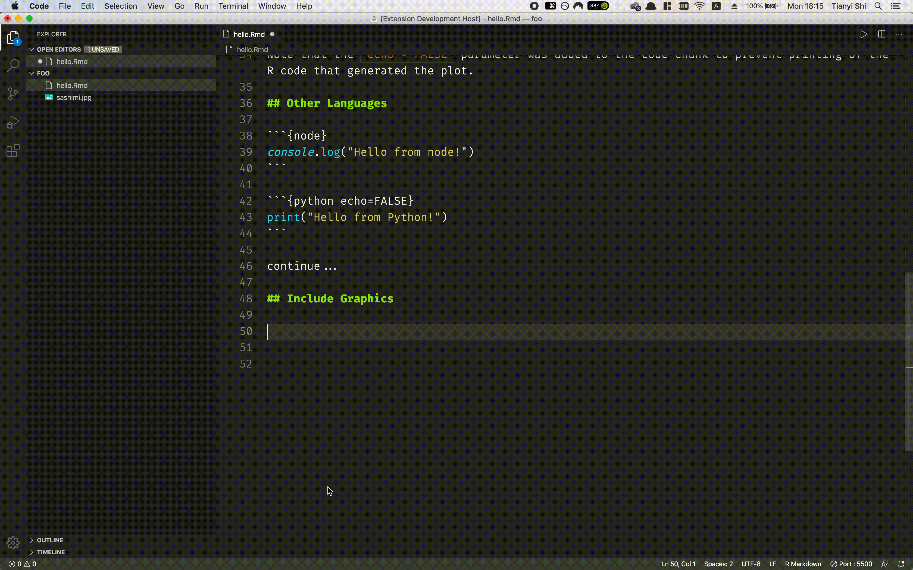

# R Markdown for VS Code

This extension provides a few snippets and key bindings for common tasks in `.Rmd` documents, such as inserting code chunks and including images using `knitr::include_graphics()`.

## Video Demos

_If you prefer reading text, jump to [RMarkdown-Specific Features from here](#user-content-rmarkdown-specific-features)._

### Code Chunk

As you would do in RStudio, you can use `Ctrl/Cmd+Alt+I` to insert a code chunk. The language deafaults to R, but you can use [many other langauges](https://bookdown.org/yihui/rmarkdown/language-engines.html).

The first tab stop allows you to configure this code chunk (language, label, `eval`, `echo`, etc.), and the second one is where you write the code. The third tab stop inserts a blank line between after the code chunk, which is required by the `.Rmd` format.

### Include Graphics

In the world of R Markdown, `knitr::include_graphics()` is [the preferred way of inserting images over](http://zevross.com/blog/2017/06/19/tips-and-tricks-for-working-with-images-and-figures-in-r-markdown-documents/#more-functionality-from-include_graphics) Markdown's native `` syntax. If you don't know it, you should. Its syntax, however, is rather verbose.

With VSCode RMarkdown extension, you use the `\fig` snippet.

### Knitting

Use `Ctrl/Cmd+Shift+K` to knit the document with options specified in the YAML header, like in RStudio.

## RMarkdown-Specific Features

### Keyboard Shortcuts:

|    Description    | Windows/Linux  |      Mac       |                                       Note                                       |
| :---------------: | :------------: | :------------: | :------------------------------------------------------------------------------: |
| Insert Code Chunk |  `Ctrl+Alt+I`  | `Cmd+Option+I` | The first tab stop allows for easy configuration, the second for the actual code |
|       Knit        | `Ctrl+Shift+K` | `Cmd+Shift+K`  |   Knit current `.Rmd` document with options specified in the YAML frontmatter    |

### Snippets

#### Cross-referencing

`\ref` or `\@ref`: general cross-reference; inserts `\@ref($1)`
`\refsec` or `\@sec`: section cross-reference; inserts `Section \@ref($1)`
`\reffig` or `\@fig`: figure cross-reference; inserts `Figure \@ref(fig:$1)`
`\reftab` or `\@tab`: table cross-reference; inserts `Table \@ref(tab:$1)`

#### Chunks

`\code`: insert a code chunk
`\fig`: insert a chunk using `knitr::include_graphics()` to include an image; hit tabs to conviniently fill out label, `fig.cap` and `out.width`.

## Other Markdown Features

### Syntax Highlighting

Mostly adapted from [microsoft/vscode](https://github.com/microsoft/vscode/tree/master/extensions/markdown-language-features) and [yzhang-gh/vscode-markdown](https://github.com/yzhang-gh/vscode-markdown).

### Keyboard Shortcuts

Mostly adapted from [yzhang-gh/vscode-markdown](https://github.com/yzhang-gh/vscode-markdown).

|  Description   | Windows/Linux |    Mac    | Note |
| :------------: | :-----------: | :-------: | :--: |
|  toggle bold   |  `Ctrl + B`   | `Cmd + B` |      |
| toggle italics |  `Ctrl + I`   | `Cmd + I` |      |

## TODO

- general
  - adapt and modify existing markdown support extensions
    preview HTML/PDF
  - insert tables (with labels and captions)
  - citation autocompletion
- bookdown support
- blogdown support
  - new post snippet (c.f. psql)

## Change Log

See [CHANGELOG.md](./CHANGELOG.md)

<!-- ## Requirements

If you have any requirements or dependencies, add a section describing those and how to install and configure them.

## Extension Settings

Include if your extension adds any VS Code settings through the `contributes.configuration` extension point.

For example:

This extension contributes the following settings:

* `myExtension.enable`: enable/disable this extension
* `myExtension.thing`: set to `blah` to do something

## Known Issues

Calling out known issues can help limit users opening duplicate issues against your extension.

## Release Notes

Users appreciate release notes as you update your extension.

### 1.0.0

Initial release of ...

### 1.0.1

Fixed issue #.

### 1.1.0

Added features X, Y, and Z. -->
